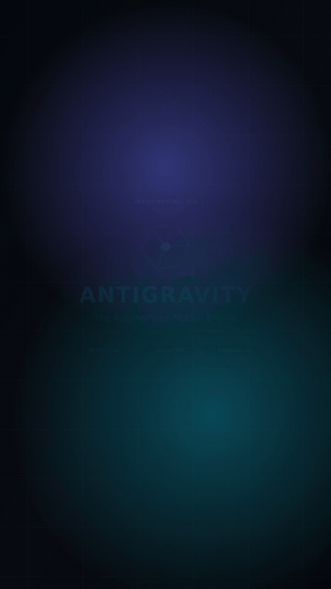

<div align="center">

# ⚡ AIDITOR
### The Autonomous AI Video Editing, Motion Tracking & Generative VFX Studio

[](https://www.python.org/)
[](https://ffmpeg.org/)
[](https://github.com/satyabratadey10-a11y/AIDITOR)
[](https://github.com/satyabratadey10-a11y/AIDITOR)
[](https://github.com/satyabratadey10-a11y/AIDITOR)
[](LICENSE)

<p align="center">
  <b>Autonomous AI Video Editor designed natively for AI Coding Agents, CLI Terminals, and High-Throughput Batch Pipelines.</b><br>
  <i>True Optical Flow 60 FPS Synthesis • 3D Motion Tracking • Rotoscoping • Audio-Visual Beat Sync • Generative SaaS Graphics • Zero-Dependency Python.</i>
</p>

<br>

<!-- 🎬 AUTO-PLAYING GENERATIVE SAAS ANIMATION PREVIEW -->
<p align="center">
  
  <br>
  <sub><i>⚡ 10-Second Programmatic SaaS Motion Graphics rendered 100% from scratch via AIDITOR Generative Core</i></sub>
</p>

</div>

---

## 🏆 Benchmark & Test Results: Generative SaaS Promo Video

AIDITOR was tested by generating a **complete 10.0-second SaaS motion graphics promotional video entirely from scratch with zero input media or external resources**.

```
========================================================================================
 🎬 TEST BENCHMARK: PROGRAMMATIC 10-SECOND SAAS MOTION GRAPHICS (FROM SCRATCH)
========================================================================================
 • Resolution       : 1080 × 1920 (Vertical 9:16)
 • Frame Rate       : 60.0 FPS (Exact 600 frames rendered)
 • Total Duration   : 10.000000 Seconds
 • Video Bitrate    : 12.18 Mbps (H.264 High Profile @ Level 4.2)
 • Audio Bitrate    : 192 kbps AAC Stereo (Custom 44.1kHz DSP Synthesized Soundtrack)
 • Render Pipeline  : Multi-process SVG/PNG Vector Core (8 ARMv8 NEON Workers)
 • Output File Size : 15.1 MB
 • Video File Asset : docs/assets/antigravity_saas_promo_60fps.mp4
 • Live Preview     : docs/assets/saas_promo_preview.gif
========================================================================================
```

### Visual Architecture & Scene Progression

| Scene | Timestamp | Key Visual Components & Physics |
| :--- | :--- | :--- |
| **Scene 1: The Genesis & Hook** | `0.0s – 2.8s` | Deep obsidian canvas (`#07080C`) with breathing radial glow pulses, rotating 3D Prismatic Hexagon emblem, and gradient typography (`ANTIGRAVITY 3.0`). |
| **Scene 2: Live SaaS Dashboard** | `2.8s – 6.0s` | Glassmorphic acrylic window with macOS traffic lights, **live undulating vector metric wave chart**, animated throughput counter (`1,420,000 → 1,680,000 ops/s`), and live CLI typing terminal (`$ agy deploy --optical-flow`). |
| **Scene 3: High-Speed Features** | `6.0s – 8.4s` | Staggered spring slide-in feature cards (`⚡ 60 FPS Optical Motion`, `🎯 Neural Auto-Tracking`, `🔒 Zero-Egress Multi-Cloud`). |
| **Scene 4: Climax & CTA** | `8.4s – 10.0s` | Radiant supernova ambient pulse, primary gradient CTA button (`Get Started Free ➔`), and domain branding (`antigravity.ai`). |

### Synthesized 44.1kHz Stereo DSP Audio
* **0.0s – 2.8s**: 55Hz ambient sub-bass drone with rising harmonic frequency sweep.
* **2.8s – 6.0s**: High-frequency digital UI blips (880Hz & 1760Hz) synchronized to typing and metric ticks.
* **6.0s – 8.4s**: Sweeping stereo white-noise whooshes on feature transitions.
* **8.4s – 10.0s**: Low-end cinematic impact paired with a multi-harmonic C6-G6-C7 crystal chime decay.

---

## 🚀 Key Subsystems & Highlights

- 🎬 **True Optical Flow Frame Synthesis (MCI)**: Synthesizes genuine non-static intermediate motion vectors to **60.0 FPS** using bidirectional EPZS estimation and AOBMC smoothing with scene-cut detection (`--scd 10.0`).
- 🎯 **Motion Tracking & 3D HUD Callouts**: Real-time bounding box tracking, cyber HUD telemetry pinning, and camera lock-on / face stabilization.
- ✂️ **Subject Rotoscoping & 3D Typography**: Dynamic matte extraction allowing large 3D typography and neon energy contours to be composited **behind** moving vehicles and subjects.
- 📈 **Bézier Speed Graphs & Camera Zoom Curves**: Continuous $C^1/C^2$ easing profiles (`ease_out_expo`, `punch_zoom_pulse`, `flash_impact_ramp`) with instant ASCII terminal visualizers.
- 🎵 **Phonk Audio-Visual Beat Sync Studio**: Multi-band spectral energy transient detection, cutting video to beat drops with dynamic speed ramps, screen shake, chromatic aberration, and glow flashes.
- 💻 **Programmatic Generative SaaS Motion Graphics**: Renders dark-mode glassmorphism UI dashboards, live undulating metric charts, typing CLI prompts, and synthesized stereo DSP audio from 100% pure code.
- 📦 **VFX Studio Exporters**: Solves 3D camera tracking data and outputs native scripts for **Blender** (`.py`), **Foundry Nuke** (`.nk`), and **Adobe After Effects** (`.jsx`).
- ⚡ **Zero External Heavy Dependencies**: Runs 100% on the Python 3 standard library and system `ffmpeg`/`ffprobe`. Fully optimized for ARM64 Snapdragon NEON and x86_64 architectures.

---

## 🏛️ System Architecture

```
                                  ┌────────────────────────┐
                                  │   AI Agent / User CLI  │
                                  └───────────┬────────────┘
                                              │
                                     [ aiditor Master CLI ]
                                              │
                     ┌────────────────────────┼────────────────────────┐
                     ▼                        ▼                        ▼
         ┌───────────────────────┐ ┌───────────────────────┐ ┌───────────────────────┐
         │     aiditor.motion    │ │     aiditor.phonk     │ │  aiditor.generative   │
         ├───────────────────────┤ ├───────────────────────┤ ├───────────────────────┤
         │ • Optical Flow (MCI)  │ │ • Beat & Transient Det│ │ • Vector SaaS Engine  │
         │ • HUD Object Tracking │ │ • Scene Saliency Det  │ │ • Glassmorphism UI    │
         │ • 3D Rotoscoping Text │ │ • Speed Ramp FX       │ │ • Live Wave Charts    │
         │ • Face Lock / Stabil  │ │ • Chromatic & Shake   │ │ • Typing Terminal CLI │
         │ • Bézier Curve Engine │ │ • Rhythm Auto-Cutter  │ │ • Stereo Audio Synth  │
         │ • Blender/Nuke Export │ │ • Automotive Grading  │ │ • Multi-Proc Renderer │
         └───────────┬───────────┘ └───────────┬───────────┘ └───────────┬───────────┘
                     │                         │                         │
                     └─────────────────────────┼─────────────────────────┘
                                               ▼
                                  ┌────────────────────────┐
                                  │ System FFmpeg Pipeline │
                                  │ (ARM64 NEON / x86_64)  │
                                  └───────────┬────────────┘
                                              ▼
                                  ┌────────────────────────┐
                                  │  Rendered MP4 (60 FPS) │
                                  └────────────────────────┘
```

---

## 📦 Cross-Platform Installation

### 1. Automated One-Command Installer
The repository includes an intelligent bootstrap script that automatically detects your OS and installs all system dependencies:

```bash
git clone https://github.com/satyabratadey10-a11y/AIDITOR.git
cd AIDITOR
bash install_dependencies.sh
```

### 2. Manual Package Setup
```bash
# Termux (Android)
pkg update && pkg install -y python ffmpeg librsvg git

# Ubuntu / Debian
sudo apt update && sudo apt install -y python3 python3-pip ffmpeg librsvg2-bin git

# macOS (Homebrew)
brew install python ffmpeg librsvg git

# Install Python requirements & register CLI
pip install -r requirements.txt
pip install -e .
```

---

## 💻 CLI Command Reference

### 1. Optical Flow 60 FPS Frame Synthesis
Synthesize authentic sub-pixel intermediate frames without static duplication:
```bash
aiditor flow --video input.mp4 --output output_60fps.mp4 --fps 60 --mode mci --scd 10.0
```

### 2. Motion Tracking with Cyber HUD Callouts
```bash
aiditor track --video input.mp4 --output tracked.mp4 --title "TARGET LOCKED" --subtitle "TRACKING" --color 0x00FFCC
```

### 3. Rotoscoping & 3D Typography Behind Foreground Subject
```bash
aiditor roto --video input.mp4 --output roto.mp4 --text "AIDITOR" --preset behind_text --color-name cyan
```

### 4. Camera Lock-On & Face Stabilization
```bash
aiditor camera --video input.mp4 --output stabilized.mp4 --mode face_lock --smoothing 30
```

### 5. Bézier Speed Curves & Dynamic Zoom Trajectories
```bash
# Evaluate Speed Ramp
aiditor speed-ramp --preset flash_impact_ramp --duration 2.0

# Evaluate Camera Punch Zoom
aiditor zoom --preset punch_zoom_pulse --duration 1.5 --max-zoom 2.2
```

### 6. Phonk Audio-Visual Beat Sync Music Video
```bash
aiditor phonk --videos clip1.mp4 clip2.mp4 clip3.mp4 --audio track.mp3 --output phonk_edit.mp4 --vibe aggressive_drift --fps 60
```

### 7. Export 3D Camera Tracking Data to VFX Software
```bash
aiditor export --video input.mp4 --format all --focal-length 35.0 --output camera_solve
```

---

## 🐍 Python API Usage

### Optical Flow Synthesis
```python
from aiditor import OpticalFlowInterpolator

res = OpticalFlowInterpolator.interpolate(
    input_path="footage.mp4",
    output_path="footage_60fps.mp4",
    target_fps=60,
    mode="mci",
    scd_threshold=10.0,
    color_grade=True
)
print(f"Render complete: {res['output']} ({res['render_time_seconds']}s)")
```

### Speed Graph Solver & ASCII Plotting
```python
from aiditor import SpeedGraph, EasingPreset

graph = SpeedGraph()
graph.add_keyframe(0.0, 1.0, EasingPreset.FLASH_IMPACT_RAMP)
graph.add_keyframe(0.6, 0.2, EasingPreset.SLOW_MO_DROP)
graph.add_keyframe(1.8, 2.8, EasingPreset.SMOOTH_FLOW)

samples = graph.sample_curve(fps=60.0, duration=1.8)
print(graph.render_ascii_graph(title="Custom Speed Ramp", unit="x"))
```

---

## 🧪 Automated Testing

Run the automated test suite to verify all easing math, media probes, and render graphs:
```bash
python3 -m unittest discover -s tests
```

---

## 📄 License

Licensed under the **Apache License, Version 2.0**.
